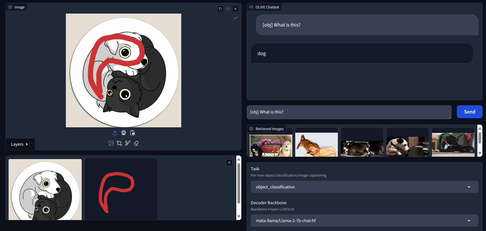

##   Object Level In-Context Visual Embeddings (OLIVE)

This repository contains the code for the paper "Object Level In-Context Visual Embeddings (OLIVE)". The repo has code to train the models described in the paper, which can be achieved by following the instructions below.


* The model allows for free form selection of areas of the image for reasoning.

* Our model does not prepend the standard array of image patch features to the LLM decoder input to speed up training and inference and be memory-friendly. This loses some information from the background, but we have found that the model can still understand object level detail and display scene content awareness.

* We experiment with object level retrieval to generalize to unseen visual concepts.


### Setup
We highly recommend setting up an anaconda environment and activating it with the required dependencies using the code below:

```python
conda env create -f environment.yml
conda activate olive
```

### Config File
This is the most important file which controls the experiments. We have several examples in the `configs` folder for different experiments.


### Datasets
Our experiments in our paper mainly involve COCO object detection and refCOCOg datasets. You only need to download COCO images for this. However, we also experiment with domain adaptation on medical images using the Chest X-Ray (CXR8) Dataset. You can download all of this COCO and medical data using our setup script. Make sure to set the `DATA_FOLDER` path in the config file first. You will have to download the **BBox_List_2017.csv**, **train_val_list.txt**, and **test_list.txt** files from their website: https://nihcc.app.box.com/v/ChestXray-NIHCC

```
python setup/setup.py
```

Some unpublished experiments also use the visual genome and GRIT datasets. The final directory structure should look like this:

```
data
|----COCO2017
    |----train
        |----000000009.jpg
        |----000000014.jpg
                ⋮
    |----val
        |----000000009.jpg
        |----000000014.jpg
                ⋮
    |----refCOCOg
        |----refs(google).p
|----CXR8
    |----BBox_List_2017.csv
    |----test_list.txt
    |----train_val_list.txt
    |----images
        |----00000887_003.png
        |----00000888_000.png
                ⋮
|----vg
    |----VG_100K
    |----VG_100K_2
|----GRIT
    |----coyo_snappy0.parquet
    |----coyo_snappy1.parquet
                ⋮
    |----images
        |----0000

```
### Retrieval Set Preparation
We have a separate script to prepare the retrieval set to train models with retrieval capability. To prepare the retrieval set, set the task to be `object_classification` in the config.yaml file and run the following script:
```
python retrieve.py --train --config <path_to_config_file>
```
This will create a .pkl file in a folder called `retrieval`.

To test the performance of retrieval only methods, you can then run
```
python retrieve.py --test --config <path_to_config_file>
```

#### Custom Retrieval Set
To prepare your own custom retrieval set, follow the format shown in the `additional_examples` folder. You may include all your desired retrieval images in the folder along with their labels in a file called `labels.txt`. To generate the retrieval set, run the scripts above, and make sure to put the path to the folder in `additional_retrieval_examples` in the config file.

### Pretrained Checkpoints
If you would like to try out the some of the models we trained, you can find them at these links. To use them, you can download them with `git lfs` and then refer to the download folder in the config file under the `load_model_path` setting.

| Name | Description |
| ------------- | ------------- |
| [OLIVE-ALL](https://huggingface.co/tossowski/OLIVE-ALL) | Model trained on object classification, description, and instruction following. |
| [OLIVE-G-Classification](https://huggingface.co/tossowski/OLIVE-G-Classification) | Model trained on object classification |
| [OLIVE-RG-Classification](https://huggingface.co/tossowski/OLIVE-RG-Classification) | Model trained with retrieval on object classification |
| [OLIVE-G-Captioning](https://huggingface.co/tossowski/OLIVE-G-Captioning) | Model trained on referring expression generation |
| [OLIVE-RG-Captioning](https://huggingface.co/tossowski/OLIVE-RG-Captioning) | Model trained with retrieval on referring expression generation |


### Training
After setting up the config file in `configs/config.yaml`, you can train a model using that config. For example, to do object classification, you may try

```python
python main.py --train --config configs/object_classification.yaml
```

Intermediate checkpoints are stored in the checkpoints folder, where you can also see the loss over parameter updates graph.

### Testing and Demo
We have some evaluation scripts for the object classification and region description tasks. For most testing, you do not need to change the `config.yaml` file from the training configuration. However, for the domain adaptation experiment, make sure to set the task to the downstream task (e.g. `medical_object_classification`), and type in the path of the pretrained model checkpoint you want to load for `load_model_path`.

You can test the model (after setting up the `config.yaml`) using:

```python
python main.py --test --config <path_to_config_file>
```

For the object classification task, if you want to check the mAP metric commonly used by COCO, please refer to [their API](https://github.com/cocodataset/cocoapi/tree/master). Our code should output a `test.json` file in the `outputs` folder which you can directly use with the API to evaluate mAP.

After training, you can also test the model qualitatively using our demo notebook. Run the cells in the `demo.ipynb` notebook to open the gradio interface:



To use the demo, make sure to put `[obj]` in your chat message to refer to your selected object. This will be replaced by the object feature during input preparation.